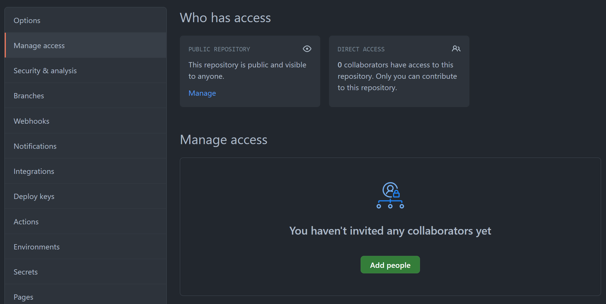

This app is a cloned version of [Contentful's blog](https://contentful.com/blog).

The project is primarily an exercise to onboard new developers in the Intercom's account for Globant.

## Goals

- Get familiarity with React, TypeScript, NextJS & Contentful.
- Adopt the component design skills used in our applications (following the [Thinking in React](https://reactjs.org/docs/thinking-in-react.html) recommendations).
- Adopt the workflow used to develop our applications.
- Identify areas where you need to improve upon or catch up with other team members.

## Prerequisites

1. Generate a new GitHub account using your Globant's email.
2. Clone the base repository found here into your new GitHub account.
3. Add your leader and teammates as collaborators for your new GitHub repository.

Go to your repository Settings > Manage access and configure like so:

4. Configure your repository such that new PRs require at least an approval before merging.

Go to your repository Settings > Branches and configure like so:

5. Configure your Personal Access Token for the Github Actions. Go to the [Tokens page](https://github.com/settings/tokens) and click on "Generate new Token". Enable all "repo" & "workflow" scopes.
   Copy the code. Create a new secret in your repository and paste the token as seen in the following screenshot:

6. Generate a new Contentful account using your Globant's email. You should have an empty space once you're done.

## Getting Started

> You should use this guide on top of the standard create-next-app [getting started guide](https://nextjs.org/docs/getting-started)

1. After cloning this project, install all dependencies using _Yarn_ with this command `yarn install`.
2. Create a new file called `.env` and copy&paste all the contents found in the file `.env.example`.
3. Enter your Contentful space and copy the secrets X and Y to the `.env` file.
4. Start the app with the command `yarn dev` and then open [http://localhost:3000](http://localhost:3000) with your browser. You should see the standard _create-next-app_ homepage.
5. If you don't see the homepage or get an error, please check the Prerequisites section and confirm there's no console errors in your terminal.

## Deploy on Netlify

**Option one:** One-click deploy

:exclamation: Please note you need to edit this button and pass the corresponding repository parameter to match your GitHub repo. E.g. `?repository=https://github.com/username/myrepo`

**Option two:** Manual connection

Connect to [Netlify](https://netlify.com/) by logging in using GitHub auth and then select your repository. The `netlify.toml` file should be ready to be picked up by the Netlify dashboard. Modify it otherwise.

## Workflow

- As you start your journey through this exercise, you should be handed a list of user stories to breakdown the work needed for this application. Typically, it comes as a PDF export.
- Read carefully the instructions on all the stories before starting your work. The full list of tasks tells you the whole story of the expected result once you complete every single item.
- Once you start working on a user story, create a new branch for such task. Feel free to use any convention you are comfortable with, but please relate your work to the number of JIRA ticket. E.g. `feat/glb-123-my-feature`
- Once you are ready to submit your work, submit a PR to your own repository. Every user story or task should represent at least one pull request in your repo. Please fill in the details following the Pull Request template.
- Every PR should trigger an automated lint check as well as a new Netlify preview deployment. Share both the PR and the Preview link with the team to get feedback.
- Once the PR is approved, merge your work before continuing with other tasks.

## How to create components

- Create new components in the `src/components` folder.
- For each new component, add a new directory. E.g. `src/component/MyComponent`.
- Inside a component directory, create an `index.ts` file. Such file should contain an exported interface named `IProps`. This interface represents the props for your component.

## Styling

To write styles, you can use either [component-level CSS](https://nextjs.org/docs/basic-features/built-in-css-support#adding-component-level-css) or [CSS-in-JS](https://nextjs.org/docs/basic-features/built-in-css-support#css-in-js) with the latter being the preferred approach for the main Intercom application.

## Got any questions?

Please contact the Intercom team through slack in #ic-core-team. The team is used to have technical conversations through code and pull requests. We encourage you to ask through code examples or submit a new Pull Request to your repository and share it with the team for feedback!
